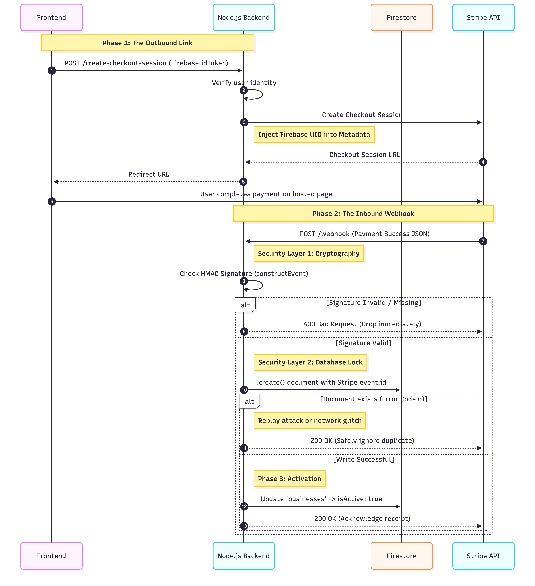
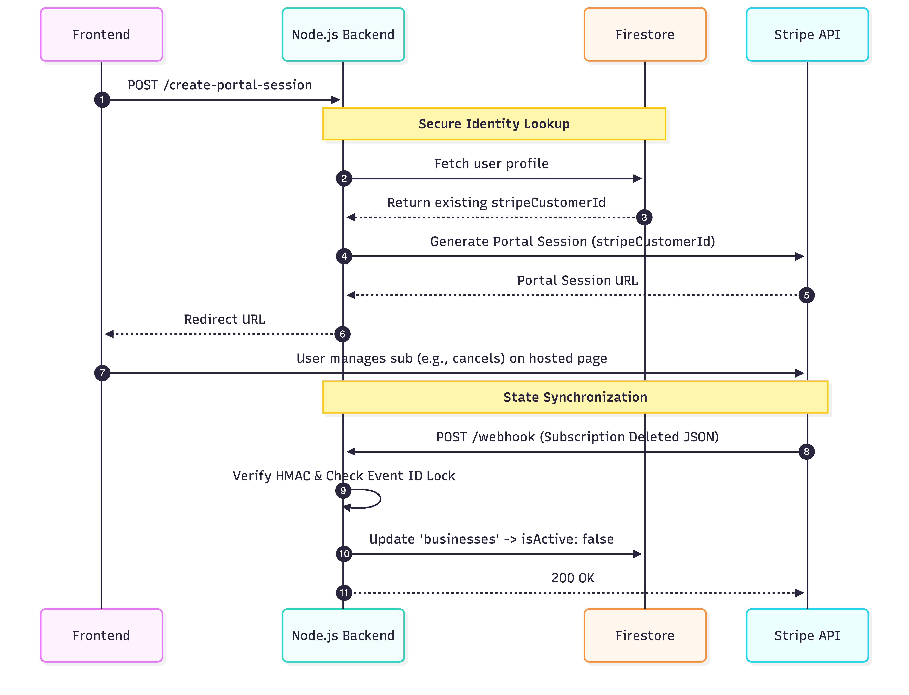
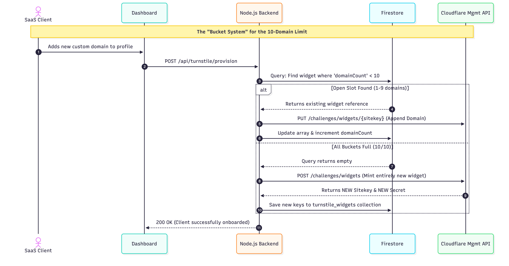
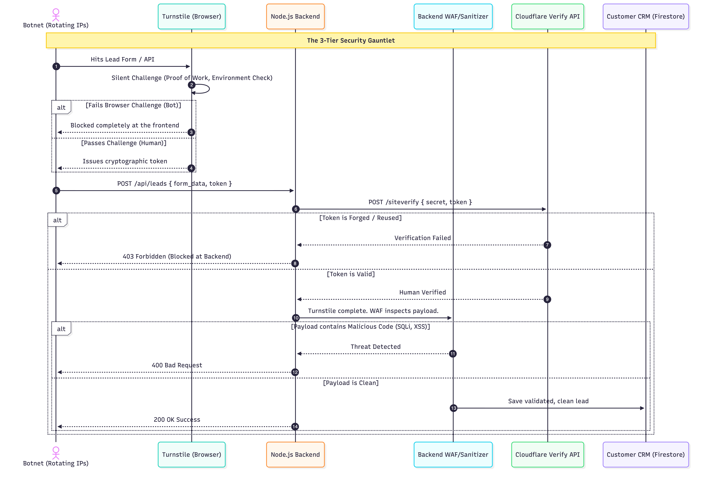
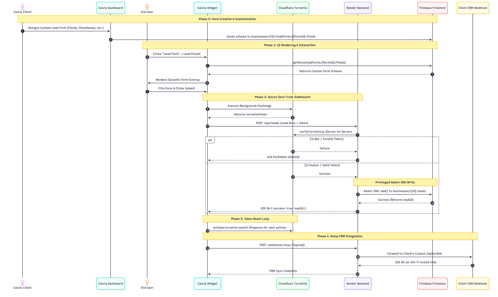
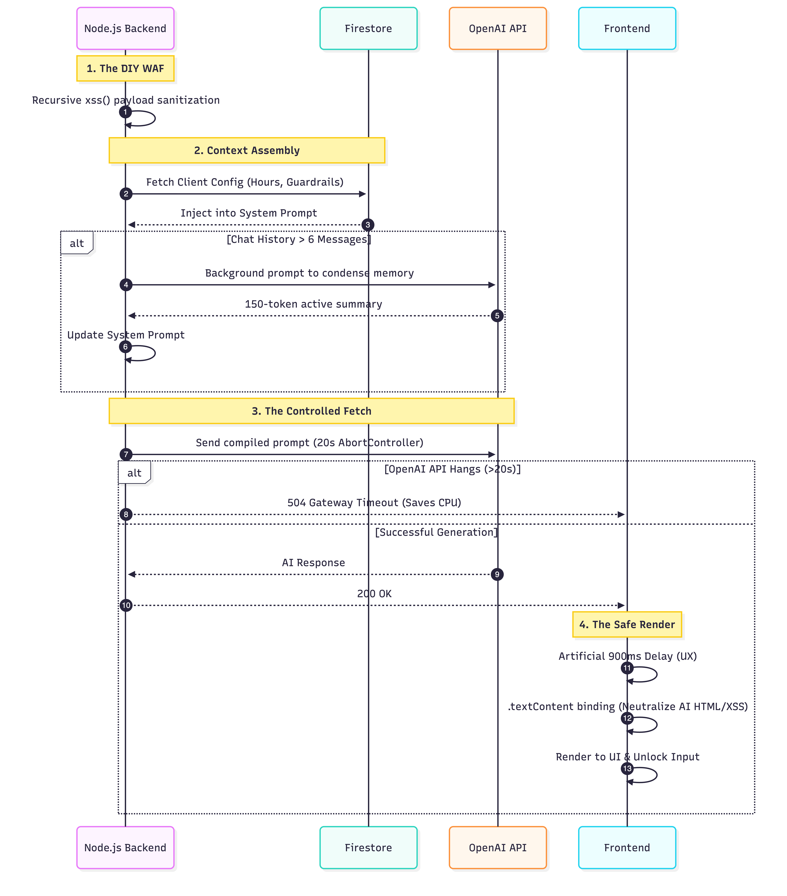
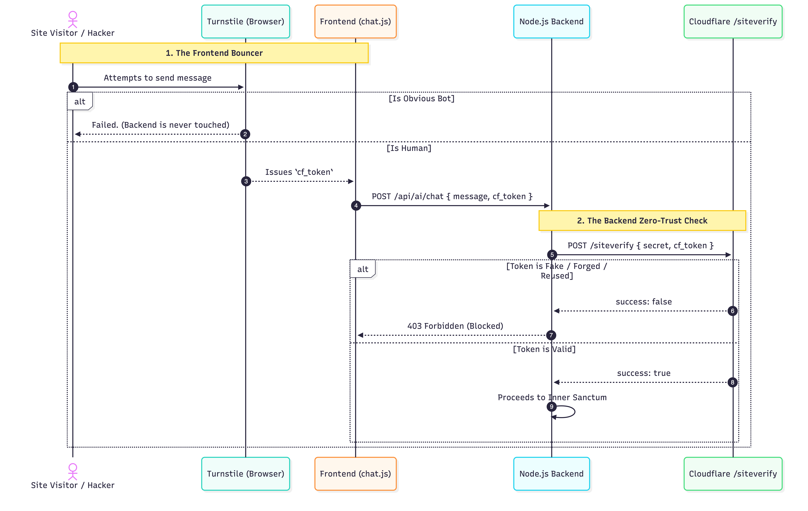

# Barnegon — AI Chat & Lead Generation Infrastructure

A production ready, SaaS platform built for service businesses. This repository contains the frontend and backend architecture, featuring zero-trust bot defense, dynamic domain provisioning, and webhook security.

## System Architecture

### 1. The Onboarding (Auth, Billing & Webhook Security)

The onboarding begins when a business owner signs up using Google Sign-In. The vulnerability here is that if you let the frontend code confirm that a payment was successful, a hacker can easily fake a "success" message and get a free account. The solution is a split process. The frontend handles sending the user to a Stripe paywall to activate their 30-day free trial, but only the backend is allowed to activate the account.

*   **First Time Sign Up:** When a new user signs up, the backend first checks their Firebase token to make sure they are a real, logged-in user.
*   **Metadata Tag:** The server asks Stripe to create a checkout page. Crucially, the server takes the user's Firebase ID and attaches it to the checkout session as hidden data (metadata). This invisible tag is how the server remembers exactly which database profile to activate after the user finishes paying on Stripe's website.
*   **Webhook Security:** Because the server's ⁠`/webhook⁠` URL has to be public to receive messages from Stripe, the threat is that anyone can try to send a fake JSON message saying a payment succeeded. Stripe signs all real messages with a secret mathematical key. When a message hits the server, it checks this signature; if the math doesn't perfectly match our server's secret key, the request is instantly deleted. Fake payments never even reach the database.
*   **Database Lock:** What if a hacker (or a network glitch) intercepts a real Stripe message and sends it to the server 100 times to crash the system? Every single Stripe message has a unique ID number. Before doing anything, the server tries to save this ID in the database. Firestore uses an atomic write (`.create()`), meaning if that ID is already there, it instantly throws an error. The server sees the error, knows it's a duplicate message, and safely ignores it.
*   **Activating the Account:** Once the webhook passes the signature check and the duplicate check, the server reads that hidden Firebase ID we saved back in Step 1. It goes to the ⁠`businesses⁠` collection, updates the user's profile to active, and saves their newly created Stripe Customer ID. Access is granted, and the user is now officially inside the app.

#### Manage/Cancel Billing

When an existing user wants to view their subscription or cancel, they click "Manage Billing". Because the platform features no stored credit cards, the frontend asks the server for a portal link. The server grabs that Stripe Customer ID we saved earlier and asks Stripe for a secure, temporary link. The user is sent to Stripe's hosted portal to cancel or update their card. If they cancel, Stripe sends another verified webhook back to our server to turn their access off.

### 2. The First-Time Setup (Dynamic Domain Provisioning)

Once the account is activated, the business owner opens a first-time setup screen. They input their core business details, most importantly, their website's domain name. This domain is whitelisted so the Barnegon chat widget can operate on their site. The domain is saved in Firestore and pushed into Cloudflare's Turnstile system for botnet defense.
Cloudflare Turnstile enforces a limit of 10 allowed domains per widget sitekey; therefore, this scalable SaaS architecture needs a dynamic provisioning algorithm so no manual intervention is needed.

*   **Capacity Polling:** When a new client adds a domain via the dashboard, the backend checks the database for a widget with a `domainCount` under 10.
*   **Dynamic Appending:** If there is an open slot (1-9 domains), the backend uses Cloudflare's Management API to add the new domain to the existing widget and increases the database counter.
*   **Autonomous Minting:** If all existing widgets are full (10/10), it automatically executes a `POST` request to Cloudflare to create an entirely new widget, retrieves the new Sitekey/Secret pair, stores it in the database, and begins filling the new widget.

### 3. The Defense (Zero-Trust & Lead Verification)

The custom chatbot is now embedded live on the client's website after injecting their script. Every time a visitor tries to submit a custom lead form or interact with the AI, the zero-trust security model activates. The system runs invisible mathematics in the background to verify the user is human before any data touches the database.
Public-facing lead forms and AI chat interfaces are prime targets for botnets and XSS injections. This architecture assumes all inbound traffic is malicious until cryptographically proven otherwise.

*   **The Frontend Bouncer:** Cloudflare Turnstile executes a silent challenge in the browser. If passed, it issues a single-use cryptographic token.
*   **Backend Verification:** Before hitting the core business logic, database, or OpenAI API, an Express middleware intercepts the request and POSTs this token to Cloudflare's `/siteverify` endpoint. Reused, missing, or forged tokens result in an immediate `403 Forbidden`.
*   **Recursive WAF Sanitization:** Once verified as human, the payload is scrubbed by a custom Web Application Firewall (WAF) script to neutralize malicious scripts before executing CRM writes.

### 4. The AI Pipeline

With the visitor verified and the prompt sanitized, the request is sent to the OpenAI API. The AI processes the business context and responds to the user.
However, chat interfaces inherently risk exponential token bloat and prompt-injection attacks. This architecture demonstrates memory consumption while ensuring UI safety and fault tolerance during those conversations.

*   **Token Bounding (Memory Compaction):** To prevent limitless context windows from causing huge API costs, the system monitors message count. Once a thread exceeds 6 messages, a background process creates the older history into a 150-token active summary, keeping memory linear.
*   **Fault-Tolerant Fetching:** LLM APIs can have extreme latency. The outbound fetch to OpenAI is wrapped in a 20-second `AbortController`. If the API hangs, the socket is cut with a `504 Gateway Timeout`, preventing suspended requests from wasting the Node.js event loop.
*   **Safe UI Injection & UX:** To minimize prompt injection attacks trying to force client-side XSS, the frontend binds the AI response using `.textContent` rather than `.innerHTML`. A 900ms delay is added before rendering to mimic human response delay.

---

## Tech Stack

*   **Frontend:** Vanilla JS, Vite, Firebase Hosting
*   **Backend:** Node.js, Express, Render
*   **Database:** Firestore (NoSQL)
*   **Security:** Cloudflare Turnstile (WAF & Zero-Trust)
*   **Payments:** Stripe Billing & Webhooks
*   **AI:** OpenAI API (with recursive context compaction)

## Local Setup

To run this environment locally, you must provide your own environment variables. 

1. Clone the repository.
2. Navigate to `/frontend` and `/backend` to duplicate the `.env.example` files into `.env`.
3. Provide your own Stripe, Cloudflare, and OpenAI test keys.
4. Run `npm install` and `npm run dev` in both directories.
